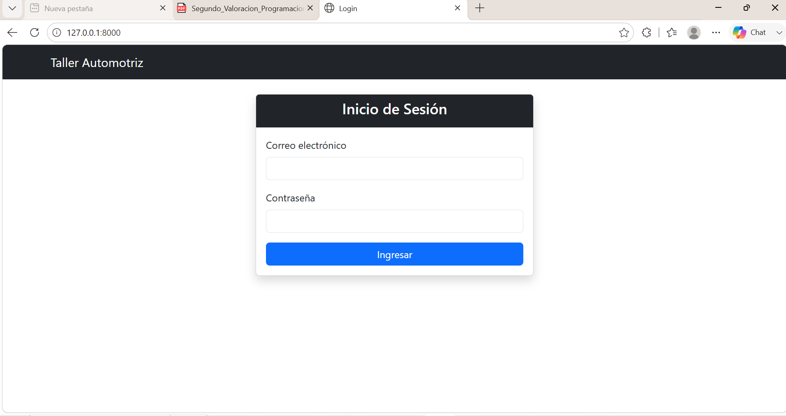
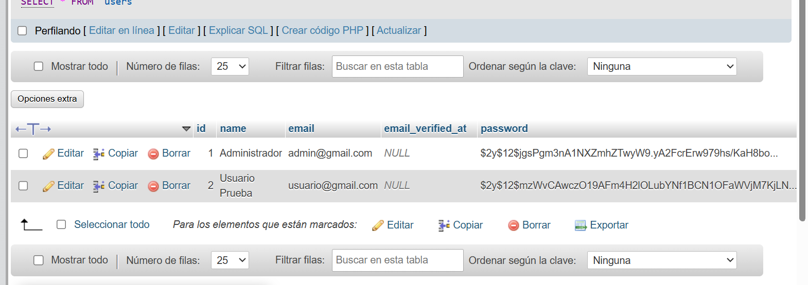
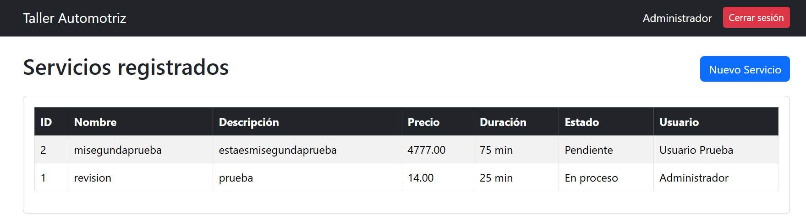
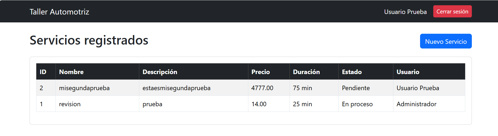
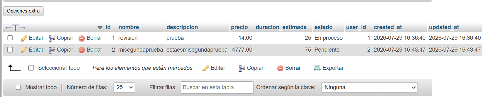
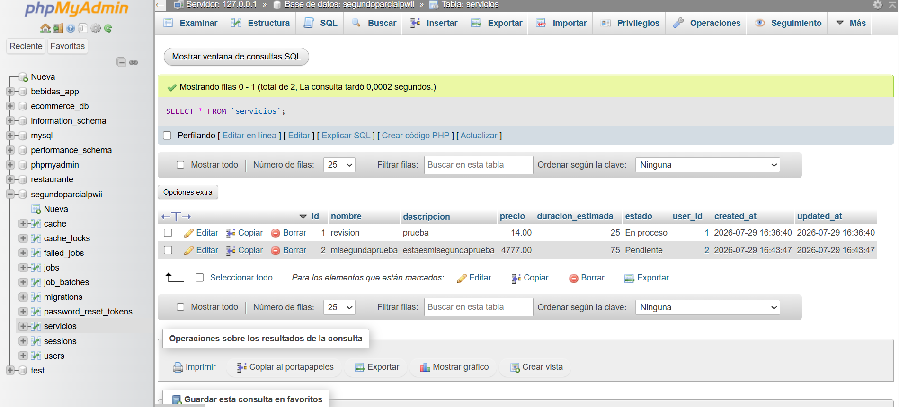
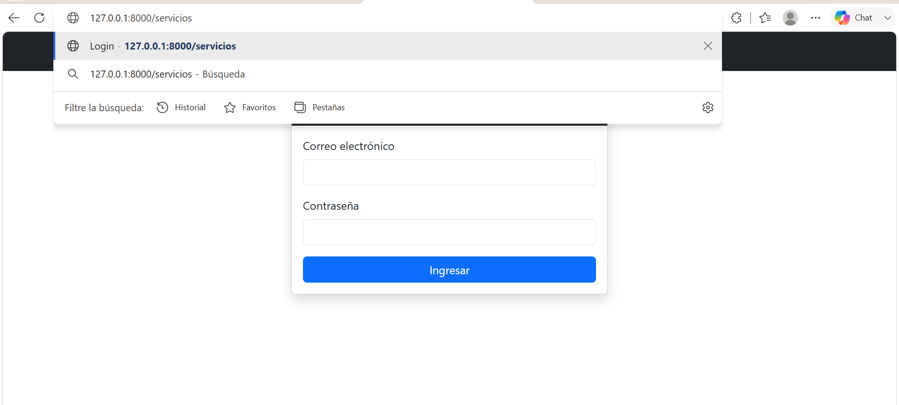

# Sistema de Gestión de Servicios - Taller Automotriz

## Descripción

Sistema web desarrollado en Laravel para la gestión de servicios de un taller automotriz.
El sistema cuenta con autenticación manual y un módulo de servicios donde cada registro queda asociado automáticamente al usuario autenticado.

---

# Pruebas de funcionamiento

## 1. El Login es la primera pantalla

Al ingresar al sistema mediante:

http://127.0.0.1:8000

se muestra directamente la pantalla de inicio de sesión.

Resultado:
✅ El usuario no autenticado es dirigido al formulario Login.

---

## 2. Existen al menos dos usuarios

Se registraron dos usuarios en la base de datos MySQL:

Usuario 1:
- Nombre: Administrador
- Correo: admin@gmail.com

Usuario 2:
- Nombre: Usuario Prueba
- Correo: usuario@gmail.com

Las contraseñas se almacenan utilizando Hash de Laravel.

Resultado:
✅ Existen dos usuarios registrados.

---

## 3. Ambos usuarios pueden iniciar sesión

Se realizaron pruebas iniciando sesión con ambos usuarios.

Usuario Administrador:

Correo:
admin@gmail.com

Contraseña:
******

Usuario Prueba:

Correo:
usuario@gmail.com

Contraseña:
******

Resultado:
✅ Ambos usuarios pueden autenticarse correctamente.

---

## 4. Cada usuario registra servicios

Usuario Administrador registró:

- Servicio: revision

Usuario Prueba registró:

- Servicio: misegundaprueba

Resultado:
✅ Cada usuario puede registrar servicios.

---

## 5. Los servicios se almacenan en MySQL

Los servicios registrados se almacenan en la tabla:

servicios

de la base de datos:

segundoparcialpwii

Resultado:
✅ Los registros aparecen almacenados en MySQL.

---

## 6. La tabla muestra correctamente el usuario que registró cada servicio

El listado de servicios muestra la relación entre servicio y usuario:

| Servicio | Usuario |
|---|---|
| misegundaprueba | Usuario Prueba |
| revision | Administrador |

Resultado:
✅ Cada servicio muestra correctamente el usuario que lo creó.

---

## 7. Logout funciona correctamente

Al presionar el botón:

Cerrar sesión

el sistema destruye la sesión y retorna al Login.

Resultado:
✅ Logout funcionando correctamente.

---

## 8. No es posible acceder a Servicios sin autenticación

Al intentar acceder directamente a:

http://127.0.0.1:8000/servicios

sin iniciar sesión:

Resultado:
✅ El sistema redirige al Login debido al middleware auth.

